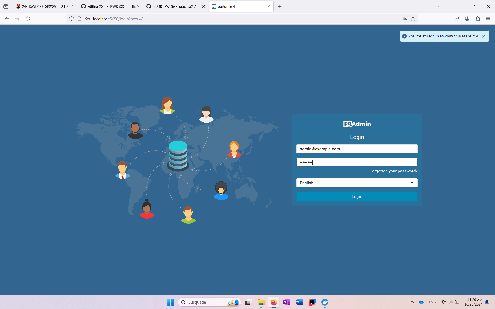
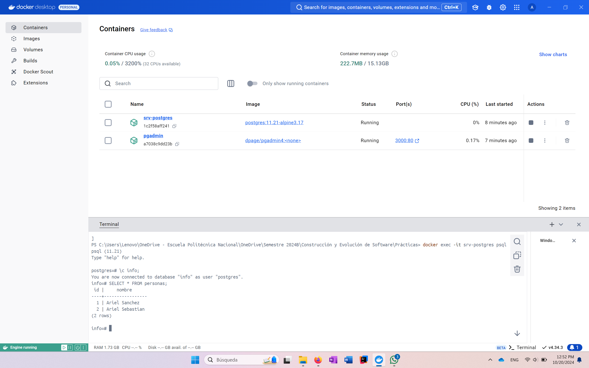

### Crear contenedor de Postgres sin que exponga los puertos. Usar la imagen: postgres:11.21-alpine3.17

# COMPLETAR

```
docker run -d --name srv-postgres -e POSTGRES_PASSWORD=P@ssw0rd postgres:11.21-alpine3.17
```

### Crear un cliente de postgres. Usar la imagen: dpage/pgadmin4

# COMPLETAR

```
docker run -d --name pgadmin -p 3000:80 -e PGADMIN_DEFAULT_EMAIL=admin@example.com -e PGADMIN_DEFAULT_PASSWORD=admin dpage/pgadmin4
```

La figura presenta el esquema creado en donde los puertos son:
- a: 5050
- b: 5432
- c: 5432


## Desde el cliente
### Acceder desde el cliente al servidor postgres creado.

# COMPLETAR CON UNA CAPTURA DEL LOGIN



### Crear la base de datos info, y dentro de esa base la tabla personas, con id (serial) y nombre (varchar), agregar un par de registros en la tabla, obligatorio incluir su nombre.

## Desde el servidor postgresl
### Acceder al servidor
### Conectarse a la base de datos info

# COMPLETAR

```
docker exec -it srv-postgres psql -U postgres
```

```
\c info;
```

### Realizar un select *from personas

```
SELECT * FROM personas;
```

# AGREGAR UNA CAPTURA DE PANTALLA DEL RESULTADO



