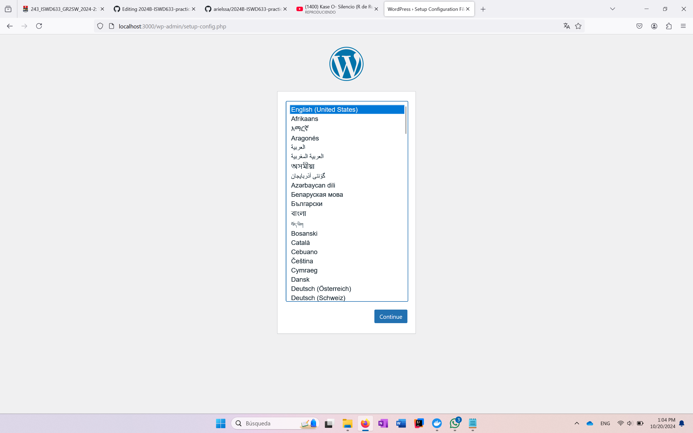
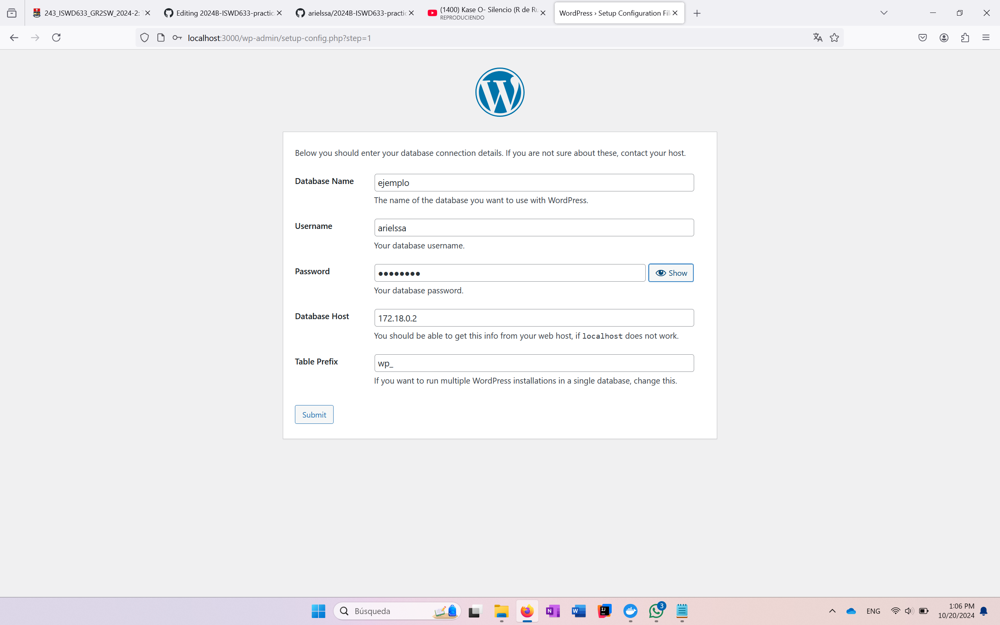
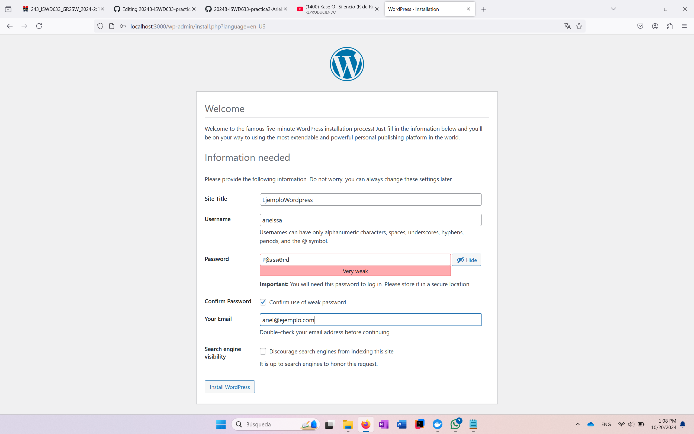
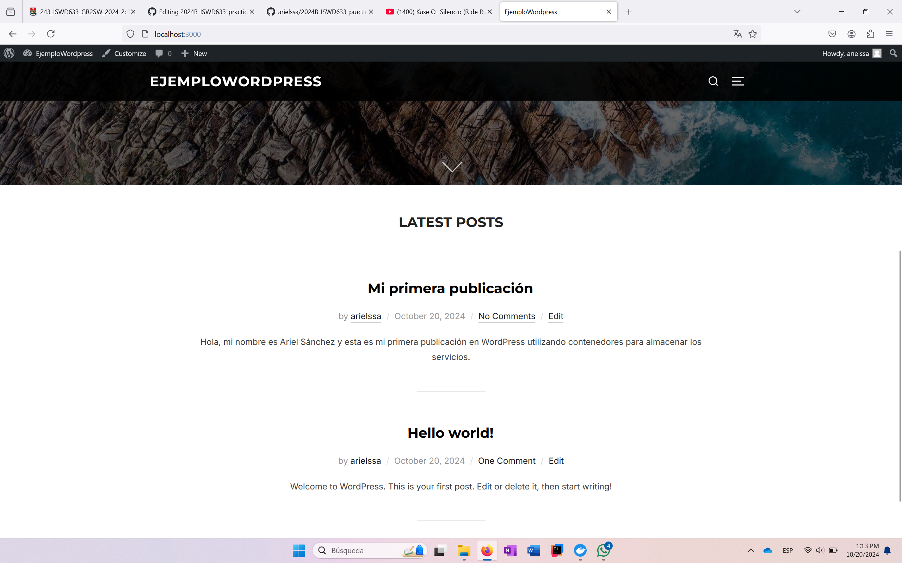

## Esquema para el ejercicio


### Crear la red

# COMPLETAR

```
docker network create net-wp
```

### Crear el contenedor mysql a partir de la imagen mysql:8, configurar las variables de entorno necesarias

# COMPLETAR

```
docker run -d --name srv-bdd --env-file=variablesEntornoMysql.txt mysql:8
```

```
docker network connect net-wp srv-bdd
```

### Crear el contenedor wordpress a partir de la imagen: wordpress, configurar las variables de entorno necesarias

# COMPLETAR

```
docker run --name wordpress-container --env-file=variablesEntornoWp.txt -p 3000:80 -d wordpress
```

```
docker network connect net-wp wordpress-container
```

De acuerdo con el trabajo realizado, en la el esquema de ejercicio el puerto a es 3000

Ingresar desde el navegador al wordpress y finalizar la configuración de instalación.

# COLOCAR UNA CAPTURA DE LA CONFIGURACIÓN







Desde el panel de admin: cambiar el tema y crear una nueva publicación.
Ingresar a: http://localhost:9300/ 
recordar que a es el puerto que usó para el mapeo con wordpress
# COLOCAR UNA CAPTURA DEL SITO EN DONDE SEA VISIBLE LA PUBLICACIÓN.



### Eliminar el contenedor wordpress

# COMPLETAR

```
docker rm wordpress-container
```

### Crear nuevamente el contenedor wordpress
Ingresar a: http://localhost:9300/ 
recordar que a es el puerto que usó para el mapeo con wordpress

### ¿Qué ha sucedido, qué puede observar?

# COMPLETAR

#### Pude observar que al eliminar el contenedor y al crearlo nuevamente ha pasado algo muy intuitivo: Se ha eliminado la configuración previa; es decir, simplemente se ha elimnado todo lo que contenía el contenedor, incluido sus configuraciones.


